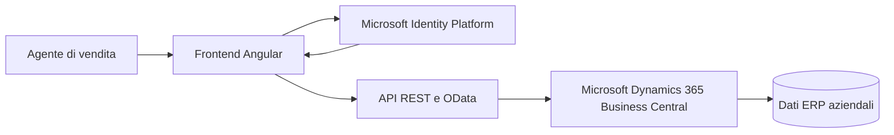

# Sales Agent Hub for Business Central


Applicazione web responsive per gli agenti di vendita, integrata con **Microsoft Dynamics 365 Business Central**.

Il progetto porta fuori dall'ERP le operazioni commerciali piu frequenti e le rende immediate anche da tablet e smartphone: consultazione del catalogo, gestione dei clienti, creazione degli ordini e registrazione delle spedizioni. Business Central rimane l'unica fonte dei dati e delle regole aziendali.

## Perche esiste

L'interfaccia completa di un ERP e potente, ma non sempre e lo strumento piu pratico durante una visita commerciale. Sales Agent Hub offre agli agenti una superficie di lavoro piu semplice, focalizzata e accessibile, senza duplicare clienti, articoli o documenti in un database separato.

## Funzionalita

| Area | Funzioni principali |
| --- | --- |
| Autenticazione | Login Microsoft con OAuth 2.0 e MSAL, associazione automatica email-agente |
| Prodotti | Catalogo completo oppure articoli assegnati all'agente, ricerca e prezzi |
| Clienti | Consultazione, ricerca, creazione e modelli cliente Business Central |
| Spedizioni | Gestione di uno o piu indirizzi di spedizione per cliente |
| Ordini | Creazione testata e righe, selezione articoli, quantita, prezzi e totale |
| Monitoraggio | Tutti gli ordini, ordini del giorno, da evadere e in consegna |
| Dettaglio ordine | Dati cliente, destinazione, righe, quantita spedita e residua |
| Registrazione | Spedizione tramite la procedura standard `Sales-Post` di Business Central |
| Interfaccia | Layout responsive per desktop, tablet e smartphone |

## Architettura



Il frontend non possiede un database applicativo. Le operazioni vengono eseguite direttamente sulle API personalizzate di Business Central, mentre l'autenticazione e delegata a Microsoft Identity Platform.

## Stack tecnologico

- Angular 21 e componenti standalone
- TypeScript 5.9
- RxJS
- Microsoft Authentication Library (`@azure/msal-browser`)
- API REST e OData di Business Central
- Estensioni Business Central sviluppate in AL
- Vitest per i test automatici

## Requisiti

- Node.js compatibile con Angular 21
- npm
- Accesso a un ambiente Microsoft Dynamics 365 Business Central
- App registration Microsoft Entra ID configurata per una Single Page Application
- Estensione AL contenente le API richieste dal frontend

## Avvio rapido

Installa le dipendenze:

```bash
npm install
```

Avvia il server di sviluppo:

```bash
npm start
```

Apri [http://localhost:4200](http://localhost:4200).

## Configurazione

La configurazione Microsoft e Business Central e centralizzata in:

```text
src/environments/environment.ts
```

Prima dell'avvio configura:

```ts
const tenantId = 'TENANT_ID';
const environmentName = 'NOME_AMBIENTE';
const companyId = 'COMPANY_ID';

export const environment = {
  microsoft: {
    tenantId,
    clientId: 'CLIENT_ID_APP_REGISTRATION',
  },
  businessCentral: {
    tenantId,
    environmentName,
    companyId,
    // ...
  },
};
```

Non inserire client secret nel frontend: una Single Page Application non puo conservarli in modo sicuro.

## API Business Central richieste

Tutte le API applicative utilizzano il namespace:

```text
/api/bs/tirocinio/v1.0/companies({companyId})/
```

| Entity set | Utilizzo |
| --- | --- |
| `agentLogins` | Associazione account Microsoft-agente |
| `prodotti` | Catalogo completo |
| `salespersonItemClusters` | Articoli assegnati agli agenti |
| `clienti` | Consultazione e creazione clienti |
| `customerTemplates` | Modelli per la configurazione dei nuovi clienti |
| `indirizziSpedizione` | Destinazioni alternative del cliente |
| `ordini` | Testate degli ordini di vendita |
| `righeOrdine` | Righe, quantita e dati di spedizione |
| `righeListinoVendita` | Prezzi specifici e generali |

## Flusso operativo

```text
Login Microsoft
      |
Associazione agente Business Central
      |
Selezione cliente e destinazione
      |
Scelta articoli e quantita
      |
Creazione ordine di vendita
      |
Registrazione della spedizione
```

## Test

Esegui la suite completa:

```bash
npm test -- --watch=false
```

I test coprono:

- filtri degli ordini del giorno, da evadere e in consegna;
- gestione della data di consegna sulle righe;
- associazione case-insensitive tra email Microsoft e agente;
- scelta tra catalogo completo e articoli assegnati;
- calcolo del totale dell'ordine.

Stato corrente: **4 suite e 11 test superati**.

## Build di produzione

```bash
npm run build
```

Gli artefatti ottimizzati vengono generati in `dist/`.

## Struttura del progetto

```text
src/
|-- app/
|   |-- domain/                 Regole di dominio testabili
|   |-- pages/                  Pagine e flussi dell'applicazione
|   |-- api.ts                  Comunicazione con Business Central
|   |-- auth.service.ts         Sessione Microsoft e profilo agente
|   |-- auth-config.ts          Configurazione MSAL
|   `-- app.routes.ts           Routing e protezione delle pagine
|-- environments/              Configurazione dell'ambiente
`-- styles.scss                 Stili globali
```

## Contesto accademico

Il progetto e stato realizzato da **Salvatore Lepore** nell'ambito del tirocinio e della tesi di laurea triennale in Informatica.

- Relatore: Prof. Gennaro Costagliola
- Tutor aziendale: Angelo Citro

## Nota

Il repository contiene il frontend Angular. Le API AL devono essere compilate e pubblicate separatamente nell'ambiente Business Central di destinazione.
